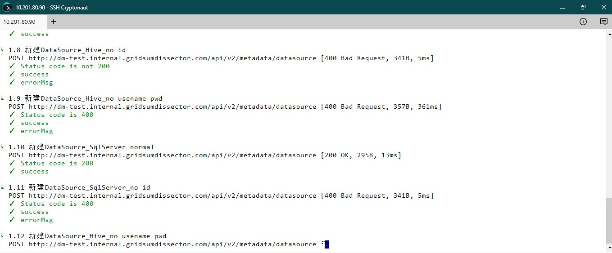

**必要条件**

 - 安装docker；[Install Docker In CentOS](https://docs.docker.com/engine/installation/linux/centos/#install-using-the-repository)
 - 在服务器上创建目录/home/postman/,并作为工作目录进行后续操作
 - 把postman中生成的case文件postman_collection_v1.json上传到服务器的目录/home/postman/下

**编写/获取Dockerfile**



$ cd /home/postman/
$ vim Dockerfile



Dockerfile内容如下：

> FROM alpine:3.3

> MAINTAINER Postman Labs <help@getpostman.com>

> \# Set node version

> ENV NODE_VERSION 4.3.0

> \# Set locale

> ENV LC_ALL en_US.UTF-8

> ENV LANG en_US.UTF-8

> ENV LANGUAGE en_US.UTF-8

> \# Install node

> RUN apk add --update nodejs=${NODE_VERSION}-r0;

> \# Set newman version

> ENV NEWMAN_VERSION 3.5.0

> \# Install newman

> RUN npm install -g newman@${NEWMAN_VERSION};

> \# Set workdir to /etc/newman

> \# When running the image, mount the directory containing your collection to this location

> \#

> \# docker run -v <path to collections directory>:/etc/newman ...

> \#

> \# In case you mount your collections directory to a different location, you will need to give absolute paths to any

> \# collection, environment files you want to pass to newman, and if you want newman reports to be saved to your disk.

> \# Or you can change the workdir by using the -w or --workdir flag

> WORKDIR /etc/newman

> \# Set newman as the default container command

> \# Now you can run the container via

> \#

> \# docker run -v /home/collections:/etc/newman -t postman/newman_alpine33 -c YourCollection.json.postman_collection \

> \#                                                                        -e > > > > > YourEnvironment.postman_environment \

> \#                                                                        -H > > > > > newman_report.html

> ENTRYPOINT ["newman"]

备注：这边直接使用https://github.com/postmanlabs/newman-docker的Dockerfile内容；也可以从该repo中下载Dockerfile

**build newman-docker image**



$ docker build -t postman/newman_alpine33 .



**run newman in docker**



$ docker run --volume="/home/postman/:/var/newman" --workdir="/var/newman" -t postman/newman_alpine33 --collection="/var/newman/postman_collection_v1.json" -f 1.DataSource --html="/var/newman/newman-report.html"



**常用选项**

- -f:指定需要运行的目录（如以上例子只运行1.DataSource下的testcase）
- --html:生成html报告
- --workdir:指定docker container的工作目录（执行newman目录时，所在的目录）

**执行截图**

**后续把newman-docker跟kubernetes-docker上的CI/CD结合起来**