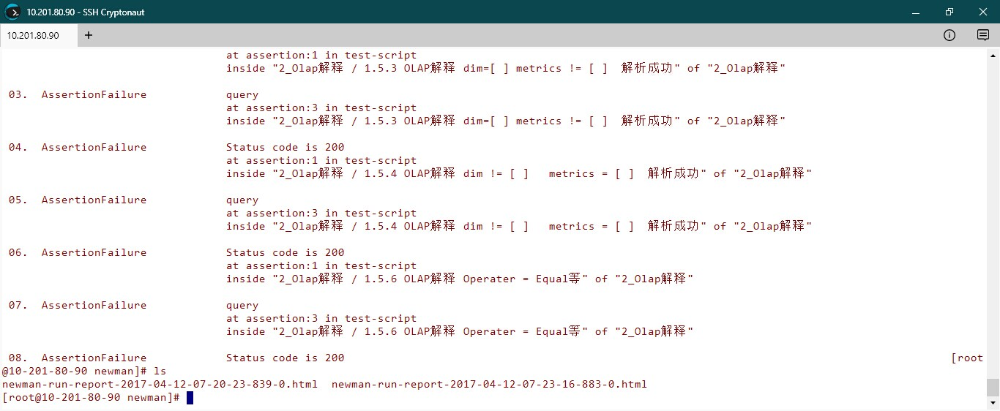

**必要条件**

 - 安装docker；https://docs.docker.com/engine/installation/linux/centos/#install-using-the-repository)
 - 在服务器上创建目录/home/postman/,并作为工作目录进行后续操作
 - 把postman中生成的case文件postman_collection_v1.json上传到服务器的目录/home/postman/下

**编写/获取Dockerfile**



$ cd /home/postman/
$ vim Dockerfile



备注：这边直接使用https://github.com/postmanlabs/newman-docker的Dockerfile内容；也可以从该repo中下载Dockerfile

**build newman-docker image**



$ docker build -t postman/newman_alpine33 .



**run newman in docker**



$ docker run --volume="/home/postman/:/var/newman" --workdir="/var/newman" -t postman/newman_alpine33 --collection="/var/newman/postman_collection_v1.json" -f 1.DataSource --html="/var/newman/newman-report.html"



**常用选项**

- -f:指定需要运行的目录（如以上例子只运行1.DataSource下的testcase）
- --html:生成html报告
- --workdir:指定docker container的工作目录（执行newman目录时，所在的目录）

**执行截图**

**后续把newman-docker跟kubernetes-docker上的CI/CD结合起来**